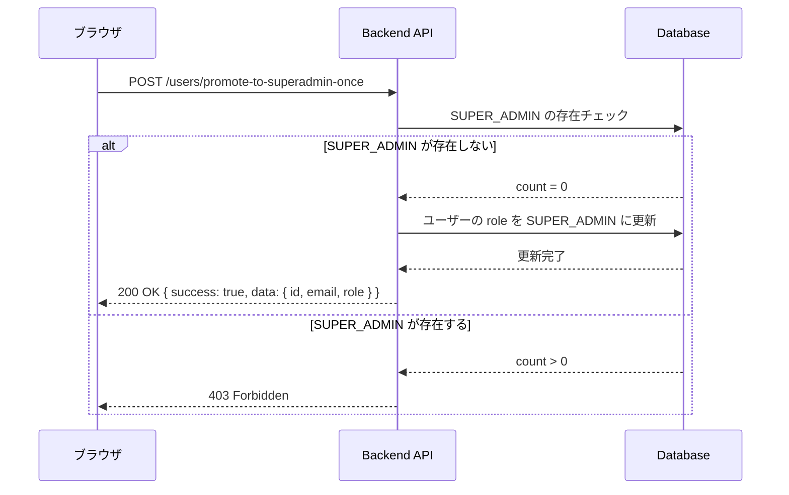

# 本番環境 初回 SUPER ADMIN セットアップガイド

本ドキュメントは、本番環境で最初の SUPER_ADMIN を作成する手順を説明します。

## 1. 概要

本番環境にアプリケーションをデプロイした後、システム全体を管理するための SUPER_ADMIN 権限を持つユーザーが必要です。この SUPER_ADMIN は、全テナント・全ユーザーを管理できる最上位権限を持ちます。

セキュリティ上の理由から、この昇格操作は **一度だけ** 実行可能です。SUPER_ADMIN がすでに存在する場合はエラーとなります。

## 2. 前提条件

- アプリケーションが本番環境にデプロイ済みであること
- データベースのマイグレーションが完了していること
- 一般ユーザーとして新規登録・ログインができる状態であること

## 3. セットアップ手順

### 3-1. 管理者アカウントを新規登録

1. ブラウザで `/register` ページにアクセスします
2. SUPER_ADMIN として使用するメールアドレスとパスワードを入力して登録します

> **💡 ヒント**: 管理専用のメールアドレス（例: `admin@your-domain.com`）を使用することを推奨します。

### 3-2. ログイン

1. `/login` ページにアクセスします
2. 登録したメールアドレスとパスワードでログインします

### 3-3. SUPER_ADMIN に昇格

1. `/setup/first-superadmin` にアクセスします
2. 現在ログイン中のアカウント情報が表示されていることを確認します
3. **「このアカウントを SUPER ADMIN に昇格する」** ボタンをクリックします
4. 「昇格が完了しました」というメッセージが表示されたら成功です

### 3-4. 動作確認

1. 昇格完了画面の **「テナント管理ページへ」** ボタンをクリックするか、`/tenants` に直接アクセスします
2. テナント管理ページが表示されれば、SUPER_ADMIN として正常に動作しています

## 4. 注意事項

| 項目 | 説明 |
|------|------|
| **一度だけ実行可能** | この昇格操作は初回セットアップ専用です。SUPER_ADMIN がすでに存在する場合はエラーになります |
| **再ログイン推奨** | 昇格後、JWT トークンの権限情報を更新するため、一度ログアウトして再ログインすることを推奨します |
| **権限の範囲** | SUPER_ADMIN は全テナント・全ユーザーを管理できる最上位権限を持ちます |

## 5. トラブルシューティング

### 「SUPER ADMIN はすでに存在するため、この操作は実行できません」と表示される

**原因**: すでに別のユーザーが SUPER_ADMIN に昇格済みです。

**対処法**:
- 既存の SUPER_ADMIN アカウントでログインしてください
- 不明な場合は、データベースで `role = 'SUPER_ADMIN'` のユーザーを確認してください

### 昇格後もテナント管理ページにアクセスできない

**原因**: JWT トークンに古い権限情報が残っている可能性があります。

**対処法**:
1. 一度ログアウトします
2. 再度ログインします
3. `/tenants` にアクセスします

### `/setup/first-superadmin` にアクセスするとログインページにリダイレクトされる

**原因**: ログインしていない状態でアクセスしています。

**対処法**:
1. `/login` でログインしてから再度アクセスしてください
2. ログイン後、自動的に `/setup/first-superadmin` にリダイレクトされます

## 6. 技術的な詳細（開発者向け）

### API エンドポイント

| メソッド | エンドポイント | 説明 |
|----------|----------------|------|
| POST | `/api/v1/users/promote-to-superadmin-once` | 現在のユーザーを SUPER_ADMIN に昇格 |

### 処理フロー



### レスポンス例

**成功時 (200 OK):**
```json
{
  "success": true,
  "data": {
    "id": "uuid-string",
    "email": "admin@example.com",
    "role": "SUPER_ADMIN"
  }
}
```

**失敗時 (403 Forbidden):**
```json
{
  "statusCode": 403,
  "message": "SUPER_ADMINはすでに存在します",
  "error": "Forbidden"
}
```

### 関連ファイル

| ファイル | 説明 |
|----------|------|
| `backend/src/users/users.service.ts` | 昇格ロジック（`promoteToSuperAdminOnce`） |
| `backend/src/users/users.controller.ts` | API エンドポイント定義 |
| `frontend/src/app/setup/first-superadmin/page.tsx` | フロントエンド UI |

---
Last Update: 2025-11-28
